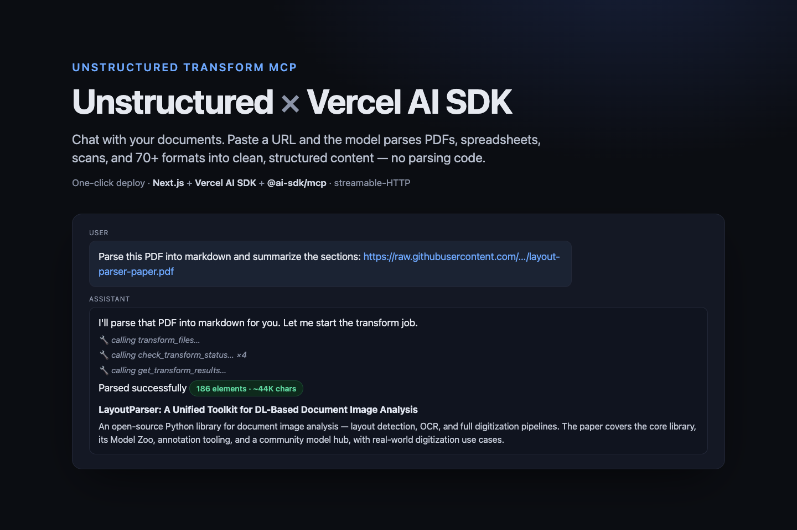

# Vercel AI SDK

Connect the Unstructured Transform MCP server to the [Vercel AI SDK](https://ai-sdk.dev),
the open-source TypeScript toolkit for building AI apps and agents, so a model can parse
files into structured data with no parsing code of your own.

**Use when:** the user shares a public document URL (PDF, spreadsheet, scan, email, and
~70 other formats) in an AI SDK app or agent and wants it turned into clean, structured
Markdown the model can read and reason over.



## Requirements

- Node.js 18 or later.
- An Unstructured API key, used as a bearer token. Get one at [transform.unstructured.io](https://transform.unstructured.io).
- An Anthropic API key (or another [AI SDK provider](https://ai-sdk.dev/providers/ai-sdk-providers)) for the chat model.

## Connect

The endpoint, transport, and tool list are in the [root README](../../README.md); this
section only shows the AI SDK client. Load the Transform tools with the AI SDK's MCP
client over streamable HTTP, passing your key as a bearer token:

```ts
import { createMCPClient } from '@ai-sdk/mcp';

const mcp = await createMCPClient({
  transport: {
    type: 'http',
    url: 'https://mcp.transform.unstructured.io',
    headers: { Authorization: `Bearer ${process.env.UNSTRUCTURED_API_KEY}` },
  },
});

const tools = await mcp.tools(); // hand these to generateText / streamText
```

## Parse example

The runnable example in [`example/`](example/) is a Next.js chat app wired to the
Transform MCP server, with a one-click **Deploy to Vercel** button. Paste a public
document URL and the model runs the full job lifecycle — start the transform, poll for
status with paced waits, fetch results, and download the parsed Markdown.

```bash
cd example
npm install
cp .env.example .env.local   # add your two keys
npm run dev
```

See [`example/README.md`](example/README.md) for the deploy button and details.

## Limits

- Files up to 50 MB each. Large or scanned documents can take a few minutes.
- Transforms are async: pace status polling so the agent's step budget covers the job.
- See the [root README](../../README.md) and the
  [Transform docs](https://docs.unstructured.io/transform/overview) for supported formats,
  parsing options, and billing.

## Next steps

- [Transform overview](https://docs.unstructured.io/transform/overview)
- [Vercel AI SDK — MCP tools](https://ai-sdk.dev/docs/ai-sdk-core/mcp-tools)
- Installation doc: [Unstructured-IO/docs#990](https://github.com/Unstructured-IO/docs/pull/990)
